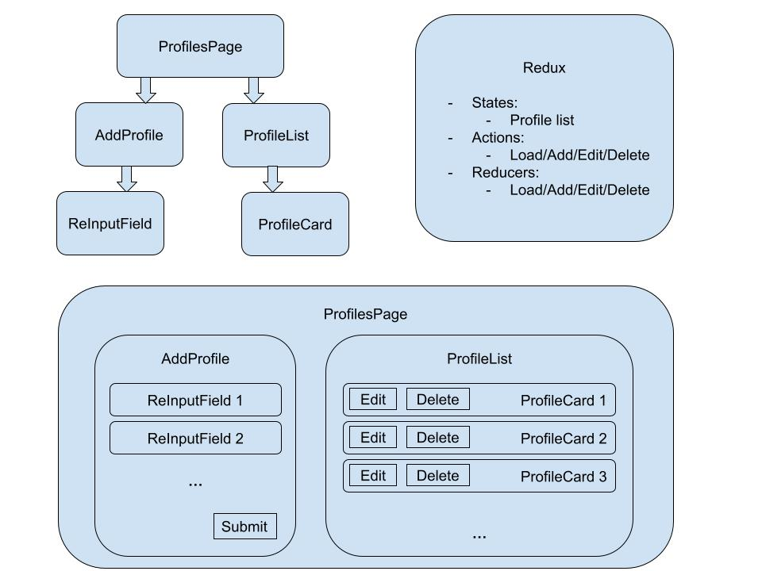

<h1 align="center">
MERNTxAWS
</h1>

> A simple React SPA for integrating various technologies and following a neat, composable architecture. The goal is to create a single page that displays a list of user profiles and a form that allows you to add user profiles to the list. See Design below.

- [Technologies](#technologies)
- [Design](#design)
- [Features](#features)
- [Bugs & Issues](#bugs--issues)
- [Set-up](#setup)
- [Full specs](#full-specifications)

## Technologies

- Node.js + Express in TypeScript
- React + Redux Toolkit in Typescript
- MongoDB + AWS S3

## Design

## Features

- When adding/editing a user profile (picture, name, email, phone), each field is validated before submission. Any invalid fields are highlighted red.
- Redux state only updates after confirming a successful response from the server (no inconsistencies) for add/edit/delete requests.
- Refreshing the page loads all the previously stored data.

## Bugs & Issues

- AWS key outdated, account likely passed the free trial period
- MongoURL keys were updated on the account but not here

## Setup

1. `npm install` in all directories (`/`, `/client`, `/server`)
2. From root dir, run `npm start`

## Full specifications

**React**
- ProfilesPage: the root component that renders the two child sibling components below.
  - ProfileList: subscribes to redux state and renders a list of reusable profile card components with their profile ID as props.
    - ProfileCard: subscribes to redux state to get the properties associated with its props profileID (picture, name, email, phone) and renders that information along with buttons to edit and delete.
      - Edit: each of the properties should become form input fields that allow users to modify its contents. The form fields should be prefilled with the existing values of that profile. Hint: conditionally render AddProfile, but you’ll need a way to customize the action type for dispatch
      - Delete: dispatch an action to delete this target profile
    - AddProfile: renders a form that contains a list of 4 reusable input field components and a button for submission. You should define an object state that contains properties for each input field and a reusable onChange handler. The onChange handler should also do basic input validation and set the validity of each input field.
      - ReInputField:
        - Renders a <label> and an <input> field using the following props:
          - id (string), type (string), name (string), value (string), valid (boolean), onChange (function)
        - The input fields should be highlighted green if valid else red if not valid. They are valid if they meet these conditions.
          - Profile picture: valid if type jpg/jpeg/png
          - Name: valid if string with only alphabetical characters
          - Email: valid if string with the format prefix@domain
          - Phone number: valid if string that contains 10 digit characters in the format xxx-xxx-xxxx
      - Submit button: this should generate the payload based on the local state and dispatch an action to the store

**Redux**
- Set it up in two different ways: the traditional way (covered during training) and with Redux Toolkit.
- Actions (type, payload), created using THUNK middleware
  - LOAD: all current profiles in the database
  - ADD: the new user profile
  - EDIT: the target user profile
  - DELETE: the target user profile
- Store (what slices of state?)
  - Profile list: this represents the list of all user profiles and their properties
- Reducers
  - LOAD: store profiles in state
  - ADD: add a user profile to the list
  - EDIT: modify an existing user profile
  - DELETE: remove an existing user profile

**Node.js**
- 4 routes, one for each request
  - GET: for requesting all user profiles
  - POST: for adding a new user profile
  - PUT: for editing user profile information
  - DELETE: for deleting a user profile
- When adding or editing a user profile with an uploaded picture, the server should communicate with S3 to reflect the changes. 

**MongoDB**
- User model has 4 properties: profile picture, name, email, phone number
- Seed the database with 5 sample users.
